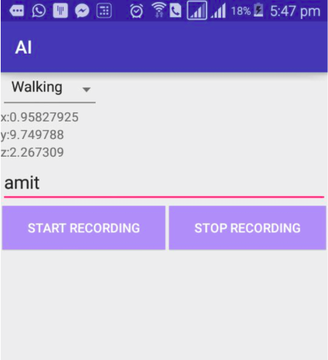
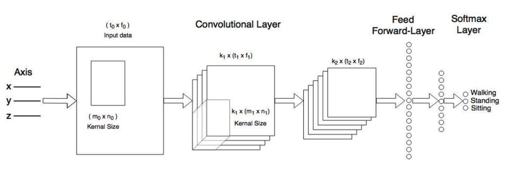
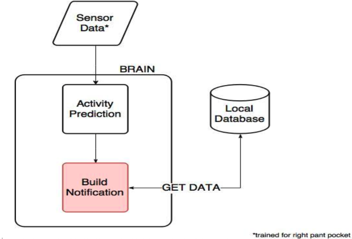
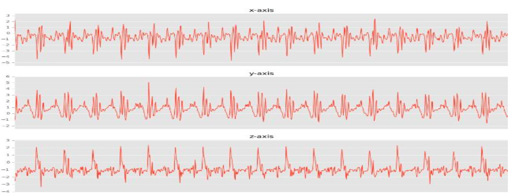

# SMARTER PHONE

## BUSINESS CHALLENGES
| Issues   |      Our Solution      |
|:----------:|:----------------------:|
| Less relevance of ads|  Smart health assistant - Improvement of recommendations based on user’s activity  |
| Extra hardware to detect person’s activity |    Improvements of ads by categorizing ads for different physical activities   |
| No generic API/SDK for the above |  API/SDK for other developers |

## APPROACH
* Step 1 - Data generation
* Step 2 - Training our activity prediction model
* Step 3 - Using prediction model on smartphones (offline) 

### STEP 1 - DATA GENERATION

* Android application developed to generate data
* Collected data of each activity for 10-15 mins from seven android phones.

### STEP 2 - TRAINING OUR PREDICTION MODEL
* Use of generated data to train our prediction model
    * Using Convolutional Neural Network (Machine Learning concept)
    * Combined 100 samples (at 50 Hz) of accelerometer data for training
    * Performed 1D Convolutional with 60x3 and 20x1 weight matrix, followed by Max Pooling
* Achieved accuracy of more than 90%

### STEP 3 - USING PREDICTION MODEL ON SMARTPHONE
* Import trained model to phone to predict the activity offline
    * Used NDK* provided by android to link TensorFlow to JAVA
    * Predict activity for 100 readings
    * Taking 100 predictions (10/minute) and finding the most occurred activity
    * Build Notifications by fetching the data from local database  
                                    *NDK - Native Development Kit
           
## TECHNICAL ARCHITECTURE

## CURRENT DATA FLOW DIAGRAM

## WALKING DATA EXAMPLE

